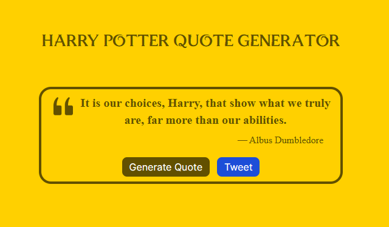
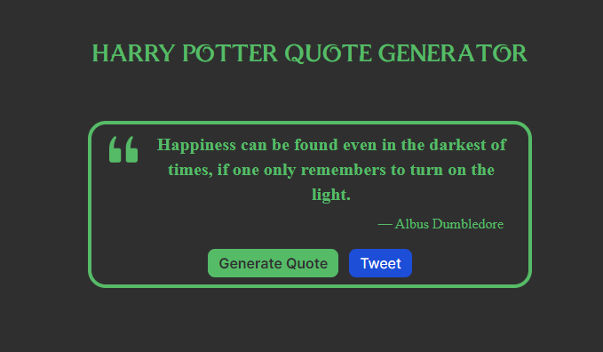
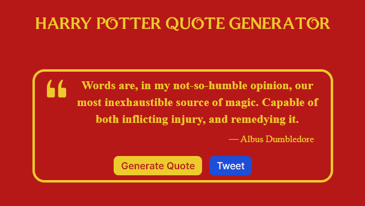
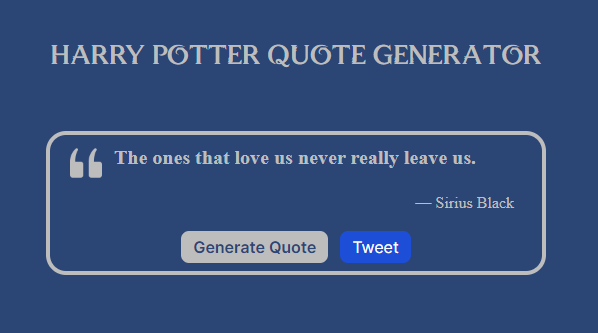

# HP Quote Generator

This is the first project for FreeCodeCamp's front end libraries certification. I decided to create a quote generator just for cool quote's from the books of Harry Potter.

The random quote generator randomly toggles between 20 selected quotes and 4 color palletes representing each Hogwarts house. You also have the option to tweet the current quote generated 

#### View quote generator at [Quote Generator](https://hp-quote-app.vercel.app/)

<table>
	<tr>
		<td></td>
		<td></td>
	</tr>
		<tr>
		<td></td>
		<td></td>
	</tr>
</table>

## Frontend Libraries used:

* React
* Tailwind
* Vanilla JS
